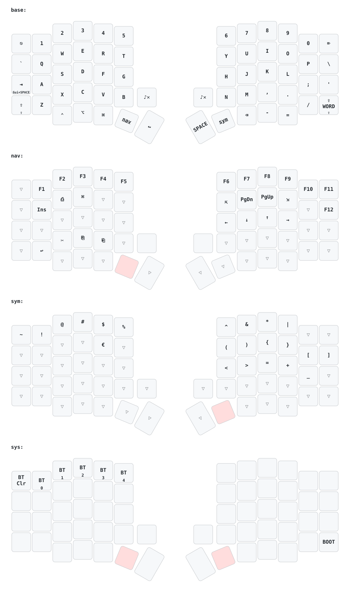

# ZMK Config — Sofle RGB V3

Personal ZMK firmware configuration for my **Sofle RGB V3** wireless split keyboard.

## Hardware

| Component | Detail |
|---|---|
| Keyboard | Sofle RGB V3 (42keebs) |
| Controller | nice!nano v2 |
| Display | nice!view (×2) |
| Encoders | EC11 rotary (×2) |

## Keymap

### Layers

| Layer | Activation | Description |
|---|---|---|
| `BASE` | Default | QWERTY, hold-tap sur TAB (Raycast), sticky shift gauche |
| `NAV` | Maintenir NAV | Navigation HJKL, F1-F12, raccourcis macOS |
| `SYM` | Maintenir SYM | Symboles de code, parenthèses, opérateurs |
| `SYS` | NAV + SYM | Bluetooth, bootloader |

### Points notables

- **TAB** : tap = Tab, hold = CMD+Space (Raycast)
- **SHIFT gauche** : tap = Sticky Shift, hold = Shift normal
- **SHIFT droit** : Caps Lock
- **CAPS** : Caps Word (majuscules pour un mot entier)
- **Encodeur gauche** : Volume ↑↓ (NAV : zoom ↑↓)
- **Encodeur droit** : Scroll ↑↓
- **NAV + SYM simultanés** → layer SYS

## Structure du repo

zmk-config-sofle/
├── config/
│   ├── sofle.keymap              # Keymap principal
│   ├── sofle.conf                # Configuration hardware
│   └── west.yml                  # Manifest ZMK (source du firmware)
├── keymap-drawer/
│   ├── sofle.svg                 # Diagramme généré automatiquement
│   └── sofle.yaml                # Intermédiaire parsé
├── .github/
│   └── workflows/
│       ├── build.yml             # Compilation du firmware
│       └── draw-keymaps.yml      # Génération du diagramme
├── build.yaml                    # Cibles de compilation (board + shields)
├── keymap_drawer.config.yaml     # Config du diagramme
└── README.md

## Modifier le keymap

1. Édite `config/sofle.keymap` sur GitHub
2. GitHub Actions compile automatiquement (~5 min)
3. Télécharge l'artifact `firmware` dans l'onglet Actions
4. Flashe le côté gauche en double-appuyant sur le bouton RESET

## Flasher le firmware

1. Double-appui rapide sur le bouton **RESET** physique sous le PCB
2. Le clavier apparaît comme un lecteur USB `NICENANO`
3. Glisse le fichier `.uf2` correspondant
4. Le lecteur se déconnecte automatiquement → c'est flashé

> Pour une modification de keymap uniquement, flasher le **côté gauche suffit**.

## Références

- [ZMK Firmware](https://zmk.dev)
- [42keebs — Sofle RGB V3](https://42keebs.eu)
- [keymap-drawer](https://github.com/caksoylar/keymap-drawer)
